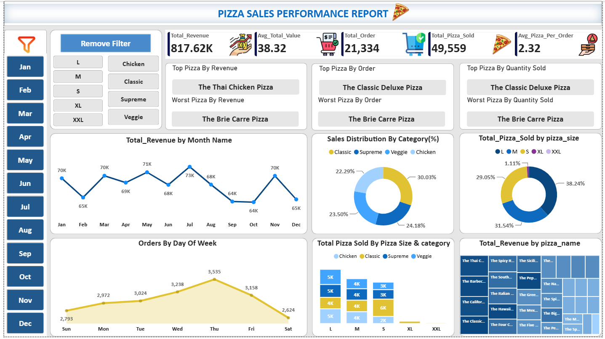

# 🍕 Pizza Sales Analytics Dashboard

## Project Overview

This project presents an interactive Pizza Sales Analytics Dashboard built in Microsoft Power BI to analyze pizza sales performance, orders, quantity sold, revenue trends, pizza categories, sizes, and individual pizza products.

The project follows an end-to-end data analytics workflow where the dataset was imported into SQL for analysis using SQL queries, and the results were visualized through an interactive Power BI dashboard.

## Tools Used

- Microsoft Power BI
- SQL
- CSV Dataset
- Data Analysis
- Data Visualization
- Dashboard Design

## Data & Analysis Workflow

1. Imported the comma-separated (CSV) dataset into SQL.
2. Performed data analysis using SQL queries.
3. Analyzed revenue, orders, quantity sold, pizza categories, pizza sizes, and product-level performance.
4. Imported the dataset into Power BI.
5. Created an interactive dashboard using charts, KPI cards, slicers, and visualizations.
6. Presented key business insights through the final dashboard.

## Dashboard Features

### KPI Cards

- Total Revenue
- Average Total Value
- Total Orders
- Total Pizza Sold
- Average Pizza per Order

### Dashboard Analysis

- Monthly Revenue Trend
- Sales Distribution by Pizza Category
- Pizza Quantity Sold by Size
- Orders by Day of Week
- Pizza Quantity Sold by Size and Category
- Revenue by Pizza Name
- Top Pizza by Revenue
- Top Pizza by Orders
- Top Pizza by Quantity Sold
- Worst Pizza by Revenue
- Worst Pizza by Orders
- Worst Pizza by Quantity Sold

### Interactive Filters

- Month
- Pizza Size
- Pizza Category

## Business Insights

- Total revenue generated was approximately 817.62K.
- A total of 21,334 orders were placed with 49,559 pizzas sold.
- The average pizza value was 38.32, with an average of 2.32 pizzas per order.
- July recorded the highest monthly revenue at approximately 73K.
- Thursday recorded the highest number of orders during the week.
- Classic pizzas contributed the highest share of sales among the analyzed categories.
- Large-size pizzas accounted for the highest share of pizzas sold.
- The Thai Chicken Pizza generated the highest revenue.
- The Classic Deluxe Pizza recorded the highest number of orders and quantity sold.
- The Brie Carre Pizza had the lowest performance across revenue, orders, and quantity sold.

## SQL Analysis

SQL queries were used to analyze the dataset and answer business-related questions such as:

- Total revenue
- Total orders
- Total pizzas sold
- Average order value
- Average pizzas per order
- Monthly revenue trends
- Daily order trends
- Pizza category performance
- Pizza size performance
- Top-performing pizzas
- Lowest-performing pizzas

The SQL queries used for the analysis are available in:

`PIZZA_SALES.sql`

## Skills Demonstrated

- SQL Querying
- Data Analysis
- Data Cleaning
- Data Transformation
- Power BI
- Data Visualization
- KPI Development
- Dashboard Creation
- Business Insights
- Interactive Reporting

## Project Preview

## Author

**Prachi Vaishkiyar**

📊 Aspiring Data Analytics | Excel | Power BI | SQL | Generative AI
